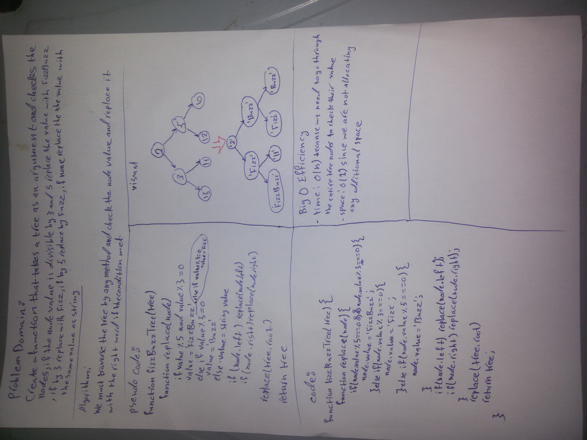

# Trees

Create a function that takes a tree as an argument and checks the nodes, if the node value is divisible by 3 and 5, return 'FizzBuzz', if by 3 return 'Fizz', if by 5 return 'Buzz', if none return the same value as a string.

## Challenge

* Write a function called FizzBuzzTree which takes a tree as an argument, and then determine whether or not the value of each node is divisible by 3, 5 or both, if the value is divisible by 3, replace the value with “Fizz”, if the value is divisible by 5, replace the value with “Buzz”, if the value is divisible by 3 and 5, replace the value with “FizzBuzz”, if the value is not divisible by 3 or 5, simply turn the number into a String and then return the tree.

## Approach & Efficiency

* We must traverse the tree by any method (like preorder, post order or in order) and then check the node's value, and if the node value is divisible by 3 and 5, change its value to 'FizzBuzz', if by 3 change its value to 'Fizz', if by 5 change its value to 'Buzz', if none return the same value as a string, and then return the tree.

* Efficiency: Big O:

-Big O of time: O(n) because it needs to go through the entire treecto check every value and change it's value.

-Big O of space: O(1) since we are not allocating any additional space.

## API

* `fizzBuzzTree(tree)`: enter a tree and change the inner values of the nodes to fizzbuzz,fizz or buzz according to their divisability.

## Whiteboard

