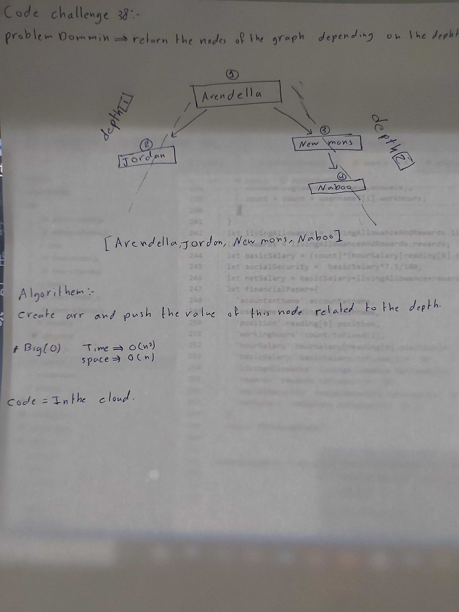

# Depth-first on a graph class-38

Utelize depth-first on a graph.

## Challenge

Create a function that accepts an adjacency list as a graph, and conducts a depth first traversal, that returns a collection of nodes in their pre-order depth-first traversal order.

## Approach & Efficiency

Utelize depth-first on a graph.

## Solution

