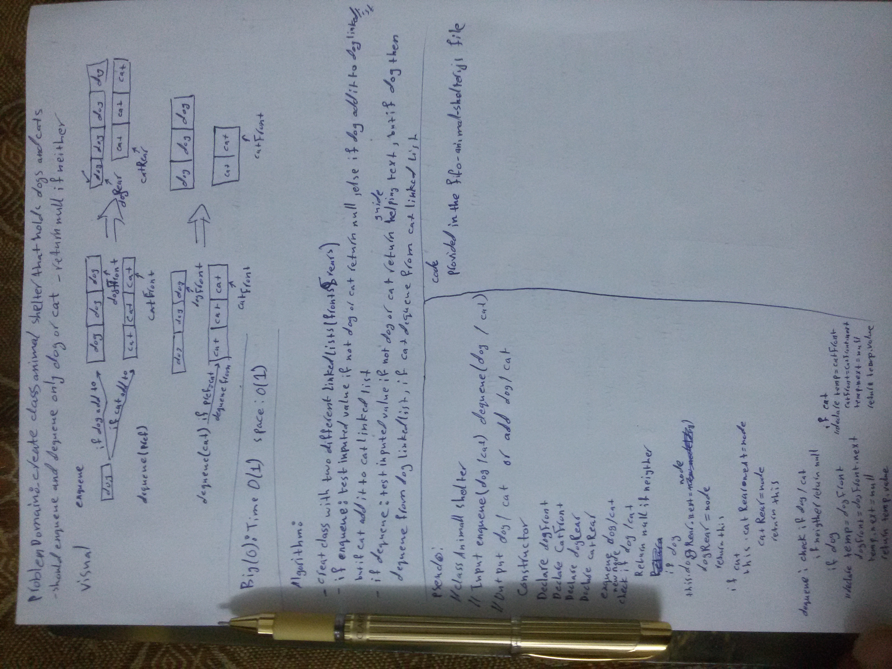

# 12. stacks and queues

Create animal shelter class using queues

## Challenge

Create a class called AnimalShelter which holds only dogs and cats. The shelter operates using a first-in, first-out approach.
Implement the following methods:
enqueue(animal): adds animal to the shelter. animal can be either a dog or a cat object.
dequeue(pref): returns either a dog or a cat. If pref is not "dog" or "cat" then return null.

## Approach & Efficiency

I used two linked-Lists one for cats and one for dogs. To enqueue, I pushed according to the input value of cat or dog to their respective linked-Lists. To dequeue, I checked the input value then returned the correct object from the corresponding linked-Lists.

### Efficiency: Big O Notation

- Time Complexity: O(1)
- Space Complexity: O(n)

## Whiteboard

