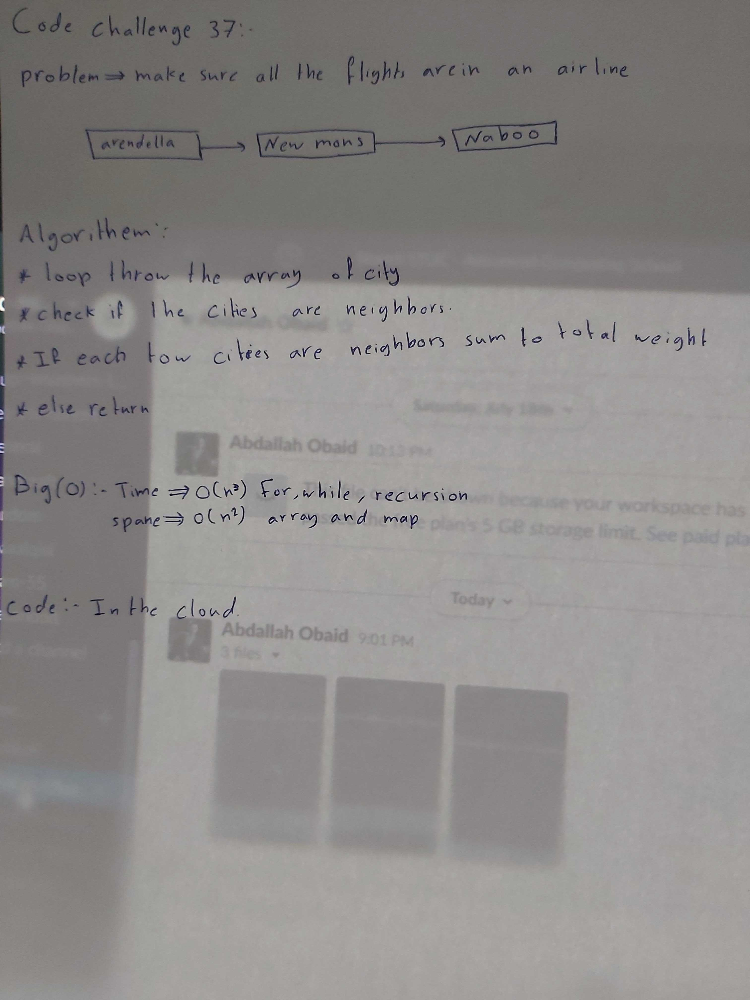

# data-structures-and-algorithms

Code challenges 401 - Data-Structures

## Get-edges on a graph class-37

Given a business trip itinerary, and an Alaska Airlines route map, is the trip possible with direct flights? If so, how much will the total trip cost be?

## Challenge

Solve the challenge.

## Approach & Efficiency

Given a business trip itinerary, and an Alaska Airlines route map, is the trip possible with direct flights? If so, how much will the total trip cost be?

## Solution

