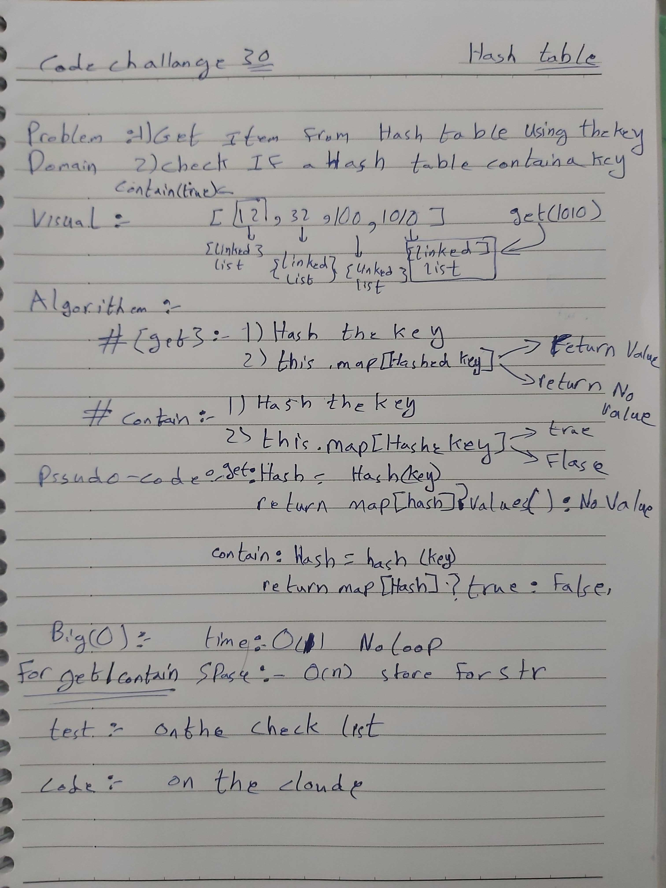

# Hashtable (Hashmaps) Implementation

## Background

Hashtables are data structure store data (key/value pairs) in an associative manner in an array format  
> keys are mapped to array positions by a hash function (algorithm)

Hashtables are very efficient and fast in retrieval of stored data, because a value stored in a hashtable can be searched in `O(1)` time, by using the same hash function that generates and address (indexed position) from the key.

The process of mapping keys to index locations is called _hashing_.

## Challenge Description

Implement a Hashtable with the following methods:

- `add`: takes in both the key and value. This method should hash the key, and add the key and value pair to the table, handling collisions as needed.
- `get`: takes in the key and returns the value from the table.
- `contains`: takes in the key and returns a boolean, indicating if the key exists in the table already.
- `hash`: takes in an arbitrary key and returns an index in the collection.

## Approach & Efficiency

- The challenge was solved using `Node` class, `Linked List`, and a `Hashmap` class.

### Big O

- Time Complexity:
  - add method:  O(1) / direct operation
  - rest of the methods: O(n) / loop

- Space Complexity:
  - all methods: O(n) / linkedlist and linear search

## Solution

