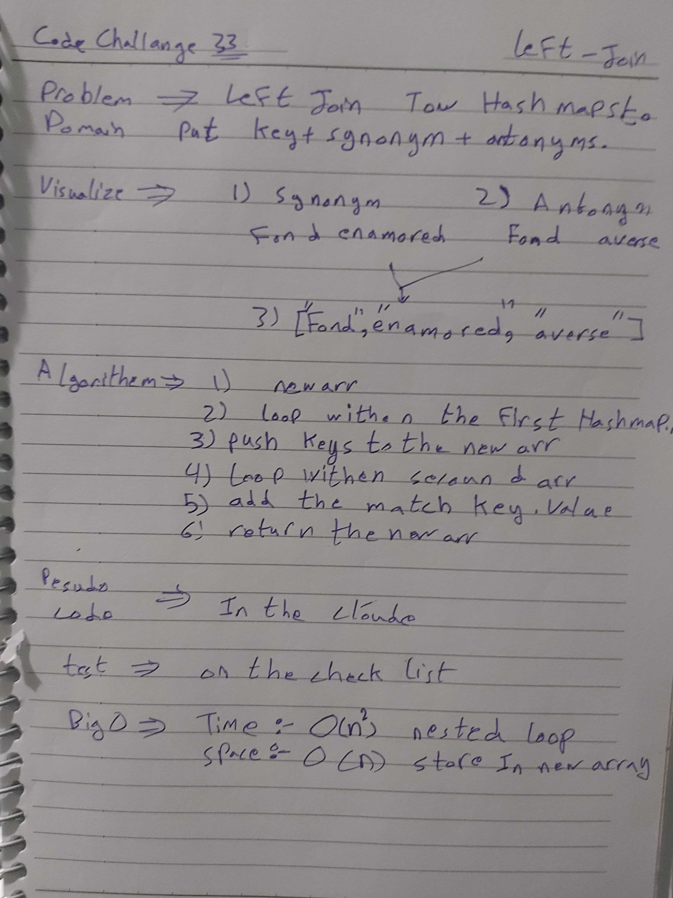

# data-structures-and-algorithms

Code challenges 401 - Data-Structures

## Implement a left Join class-33

This is about how to utilize the Hash Table Data-Structures to left join tow hash table.

## Challenge

Solve it as an object and as an Hash Table, and the part of handle the ',' withen the book

## Solution

