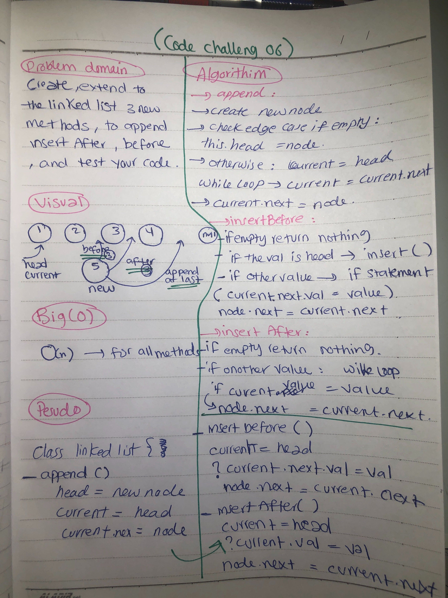

# linked list

- Implementation of the linked list (singly).

## Challenge

Create a singly linked list with these features:

- A Node class that has a  value property in the Node, and a pointer to the next Node.
- LinkedList class with a head property ,Upon instantiation, an empty Linked List is created.
- `insert()` method that takes any value as an argument and adds a new node with that value to the head of the list with an O(1) Time performance.
- `include()` method that takes any value as an argument and returns a boolean result depending on whether that value exists as a Node’s value somewhere within the list.
- `toString()` method that takes in no arguments and returns a string representing all the values in the Linked List, formatted as: `{ a } -> { b } -> { c } -> NULL`.
- `append()`which adds a new node with the given value to the end of the list
- `insertBefore()` which add a new node with the given newValue immediately before the first value node.
- `insertAfter()` which add a new node with the given newValue immediately after the first value node.

## Approach & Efficiency

- Created a Node class.
- Linked list with all the required methods.
- linked list test to test all the methods .

## Solution

