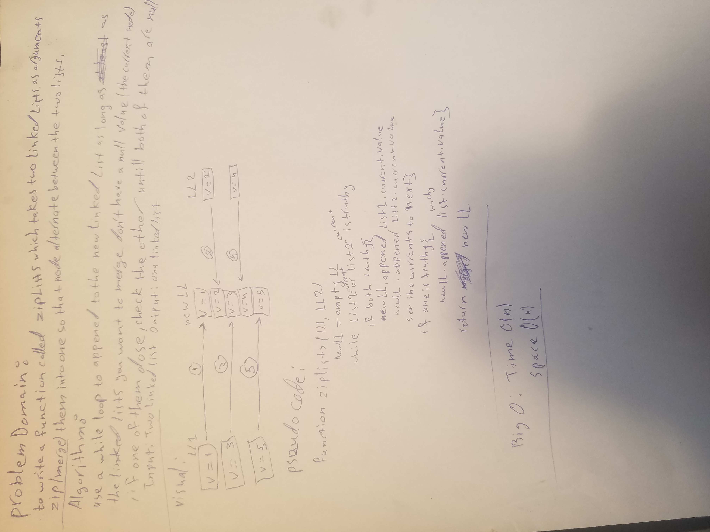

# Code Challenge 8: Merge Linked List

In this code challenge we must combine two linked lists.

## Challenge

We must create a function that takes in two linked lists and combines them into a single linked list.
Approach & Efficiency
Created a function that takes two linked lists, inside the function we create a new linked list where the combined results will reside, then using a while function as long as one of them did not reach null will keep traversing and adding to the new linked list using the append method and then returning the newly merged linked list.

## Efficiency: Big O Notation

mergeLists(list1,list2) : Space: O(n) "linear" , Time: O(n) "linear". Because it has a while loop that goes through the longest LL that were entered as an argument, it depends on how deep the LL is, so it has a Big Notation of O(n).

## API

zipLists(list1,list2) : Put two linked list as arguments and it returns a new merged list.

## Whiteboard

