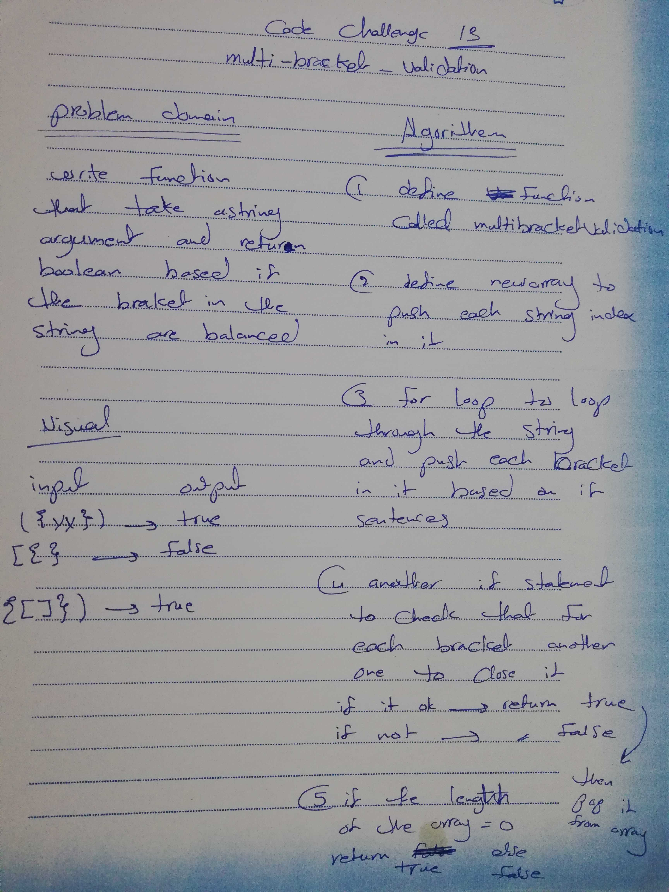

# multi-bracket-validation

## Challenge Summary

Multi-bracket Validation

## Challenge Description

write a function that should take a string as its only argument, and should return a boolean representing whether or not the brackets in the string are balanced.
There are 3 types of brackets:

Round Brackets : ()
Square Brackets : []
Curly Brackets : {}

## Approach & Efficiency

big O :
space --> O(n)
time --> O(n)

## Solution

- 
