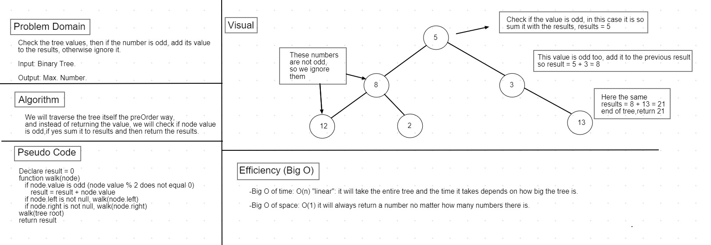

# Code Challenge 19: Sum of odd numbers in a binary tree

## Challenge

* Find the sum of all the odd numbers in a binary search tree.

## Approach & Efficiency

* We will create a depth traversal (recursive method) that walks throught the tree in preOrder traversal way, and instead of pushing the values into an array, we will check if the number is odd, if it is then sum it to the results variable, if not we ignore it.

## Efficiency: Big O

* Big O of time: O(n) "linear": it will take the entire tree and the time it takes depends on how big the tree is.

* Big O of space: O(1) "constant" it will always return a number no matter how many numbers there is.

## API

* `oddSumTree(tree)`:takes a tree as its input, walks through the entire tree and searches for node values, if the node value is odd, it sums it with the results,if not it ignores it, and then returns the result.

## Whiteboard

