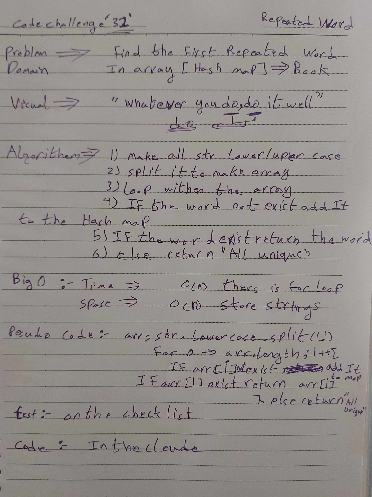

# Code Challenge 31: Repeated Word

## Challenge

* Create a function that accepts a string parameter and return the first word to occur more than once in that string.

### Approach & Efficiency

1. Create a hashmap.
2. Split the string into an array.
3. Use for loop, in each loop check for the array element(key) in the hashtable, if not exist add the value to hashmap.
4. if the key exists return the key
5. after loop finish this means there is no repeated words

### Efficiency: Big O Notation

1- Big O of time: O(n) "Linear": Because I used a for loop, the time complexity will always depend on the length of the split string.

2- Big O of space: O(n) "Linear": because we create array with lenght depending on the input

### API

`repeatedWord(text)`: Takes in a string as a parameter and returns string.

* Whiteboard:

