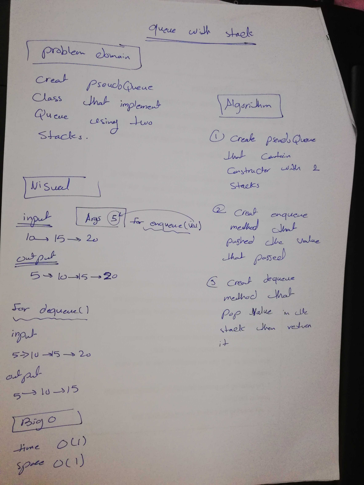

# Queue with stacks

## Code Challenge 11: Implement a Queue using two Stacks

* We must implement a queue using two stacks and their available methods from push, pop and peek only.

### Challenge

Create a brand new PseudoQueue class.

Do not use an existing Queue. Instead, this PseudoQueue class will implement our standard queue interface (the two methods listed below), but will internally only utilize 2 Stack objects. Ensure that you create your class with the following methods:

1- enqueue(value) which inserts value into the PseudoQueue, using a first-in, first-out approach.

2- dequeue() which extracts a value from the PseudoQueue, using a first-in, first-out approach.

### Approach & Efficiency

1- `enqueue(value)` Check if front got no value, if it doesnt then create a new stack and add its top value as the front, then assign it to the rear aswell, and then just keep adding to the rear.

2- `dequeue()`: assign the front.next value as the current front.

### Efficiency: Big O Notation

* Big O of time: O(1): it will always take the same time to add to the queue and to remove from the queue because it adds always to the end and removes from the start.

* Big O of space: O(1) Same as above because it wont take any additional space and will only return the last value it removed.

### API

1- `enqueue(value)`: Created a new stack,then push a new value to it, then add that value to the  rear node's next to the new node.

2- `dequeueue()`: removes the front node and replaces it with the next value.

* Whiteboard:

