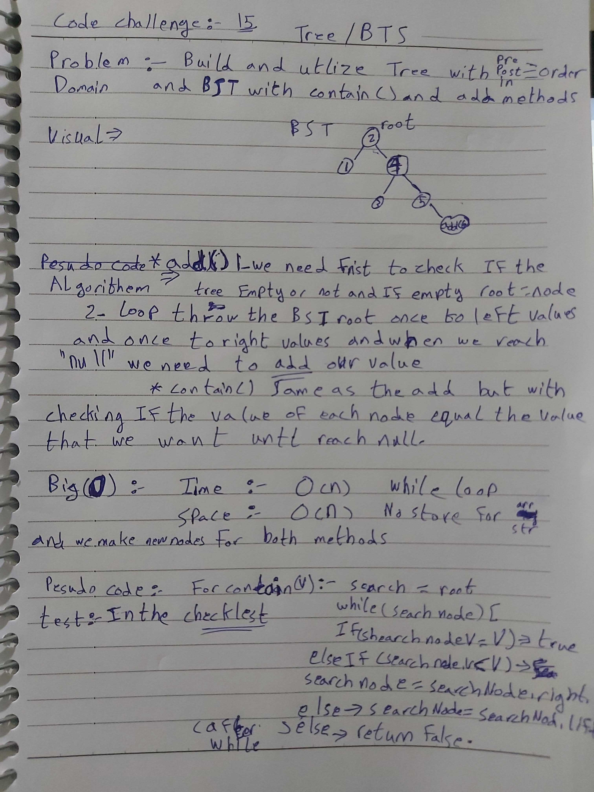
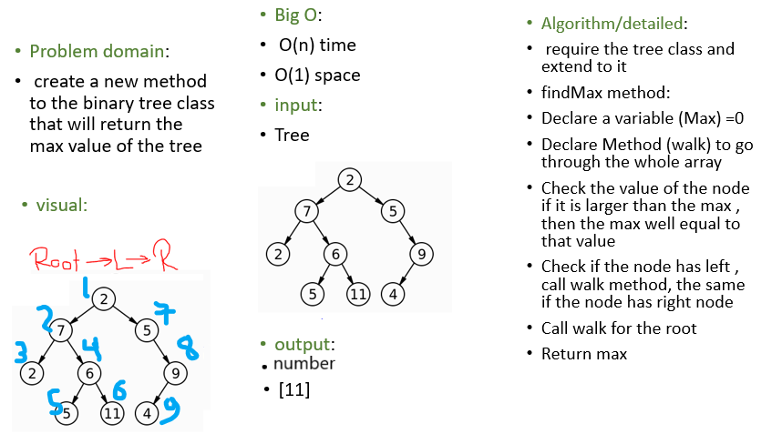
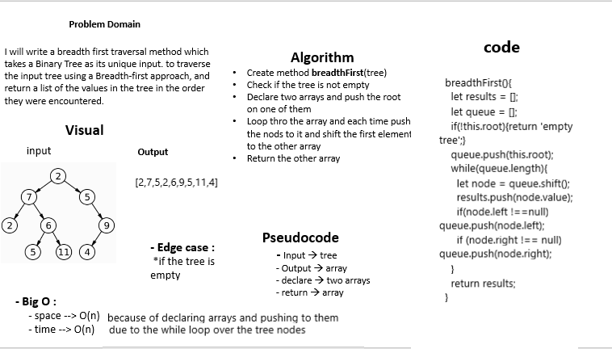

# Tree and Binary Search Tree ~ Breadth-first Traversal

You need to implement a Binary tree and a Binary tree search, in binary tree you need to have preorder, inorder and postorder searching methods, and in the binary tree search you need to have add and search methods.  
extend the tree class with find-maximum-value method

## challenge

- Create a Node class that has properties for the value stored in the node, the left child node, and the right child node.

- Create a BinaryTree class, and then define a method for each of the depth first traversals called preOrder, inOrder, and postOrder which returns an array of the values, ordered appropriately.

- Create a BinarySearchTree class, Define a method named add that accepts a value, and adds a new node with that value in the correct location in the binary search tree.
Define a method named contains that accepts a value, and returns a boolean indicating whether or not the value is in the tree at least once.

- Write an instance method called find-maximum-value. Without utilizing any of the built-in methods available to your language, return the maximum value stored in the tree. You can assume that the values stored in the Binary Tree will be numeric.

- Write a breadth first traversal method which takes a Binary Tree as its unique input. Without utilizing any of the built-in methods available to your language, traverse the input tree using a Breadth-first approach, and return a list of the values in the tree in the order they were encountered.

## Approach & Efficiency

- In the binary tree search, preOrder method, we will make a recursive function that takes the node it currently operates in, and returns the value first, checks left node second, and checks right node lasts.
- in inOrder method, same as before except left is first then return value then right node, while in postOrder, left first then right then retrieve a value.

- In Binary Search Tree, we can add a value depending on its place, if the value is higher than the root value, we go to the right node, if its smaller we go to the left, until we get to a null node then we add the new node with the new value in that place, same for search but except of adding a value, we return a boolean when a value is found.

- **Efficiency**: *Big O*:

- Binary tree: Big O of time for searching is O(n) at the worst possible search it will take the entire tree.  
Big O of space is O(w) where w is the width of the tree

- Binary Tree Search: Big O of time is O(h) where h is height  
Big O of space is O(1) since we are not allocating additional space.

- find-maximum-value: Big O of time for searching is O(n) because it will compare max value with each node in the tree.  
Big O of space is O(1) since we are allocating a constant space in the memory(the space does not change whatever is the input)

- breadthFirst : Big O of time for traversing is O(n) because we loop over all the tree nodes.  
Big O of space is O(1) since we are declaring arrays and use them to store node values, so their lenght depend on the input and changes according to it.

## API

- `preOrder`: returns the values of the root, then the left nodes, then the right nodes.

- `inOrder`: goes to the left nodes, then returns the values of the  root then goes to the right nodes.

- `postOrder`: goes to the left nodes, then goes to the right nodes, then returns the values of the root.

- `add(value)`: adds a new node to the tree depending on the value it has, keeps going to left node if the value is lower and right if the value is higher until a node doesnt exists, then replaces it.

- `contains(value)`: search a tree for a value and returns true if its found, otherwise returns false.

- `findMaximumValue`: return the maximum value stored in the tree

- `breadthFirst` : iterates through the tree by going through each level of the tree node-by-node.

## Solution

