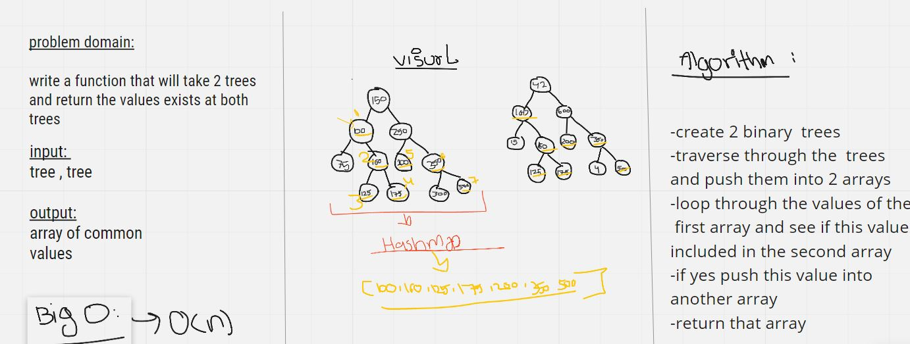

# Tree Intersection

- Implementation of binary trees

## Challenge

write a function that will take 2 binary trees and return the values in common exist at both trees

## big(O)

- time: O(n) : because of the loop over the tree nodes
- space: O(n) : because the function creates array with elements count that depends on the inputed tree

## Solution

