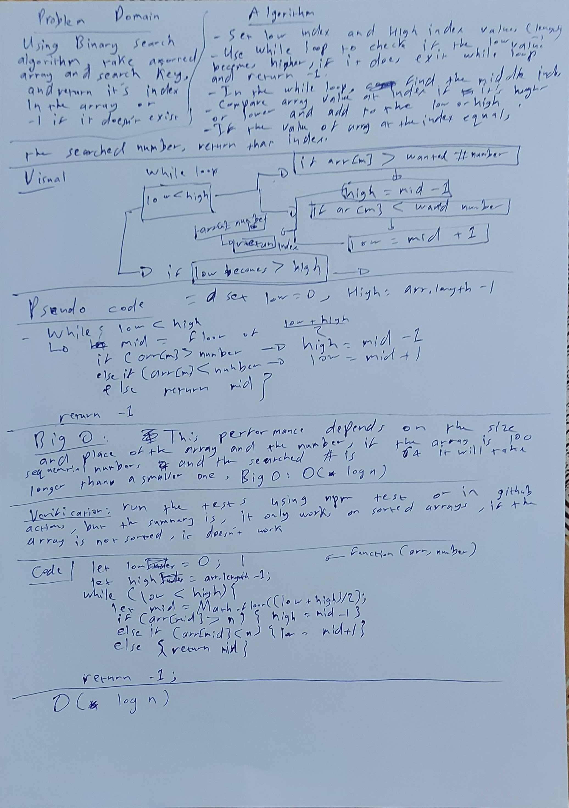

# Summary

Using Binary Search algorithm, make a function that takes in a sorted array and a number and gives you the index.

## Challenge

Write a function called BinarySearch which takes in 2 parameters: a sorted array and the search key. Without utilizing any of the built-in methods available to your language, return the index of the array’s element that is equal to the search key, or -1 if the element does not exist.

## Approach & Efficiency

* First you must set the low index to zero and high index to the length of the array -1

* Use a while function to check if the index low index stays below the high index, if the low index becomes higher than the high index then that means the number you are searching for doesn't exist, and so -1 will be returned

* if the value of the array middle indexis higher than the number, then the answer is in the first half of the array so you must assign new high index value to be mid index - 1

* if its the opposite, then you must increase the low index by mid index value +1

* if the value of the array at the mid index equals the value of the searched number, then return that index.

* Efficiency: Big O: O(n)

## Solution

