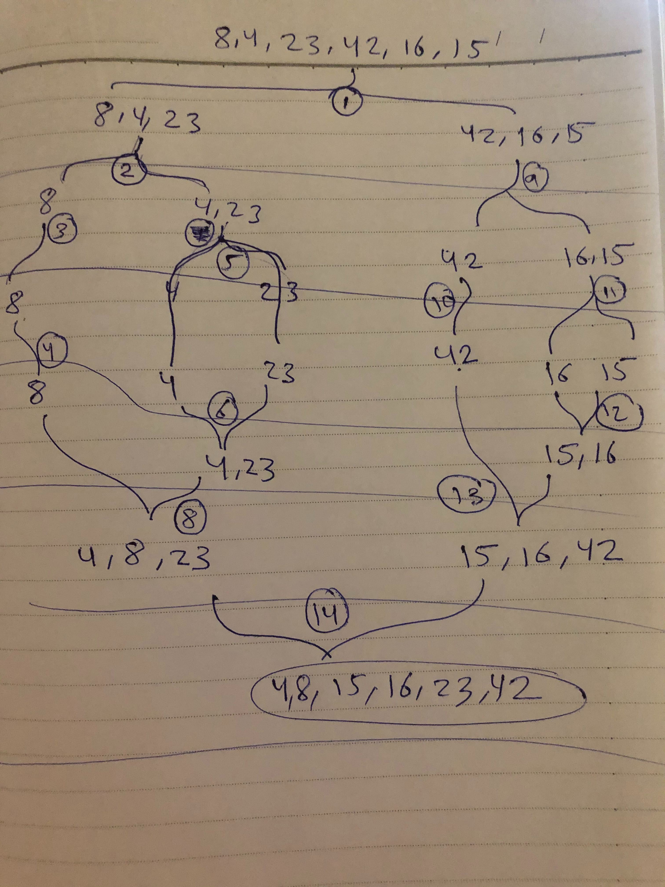

## Efficiency

- Time: O(n logn) because at it's worse, there will be a while loop and how many times the array is split.

- Space: O(n) Because the memory allocated depends on how big the array itself is.
