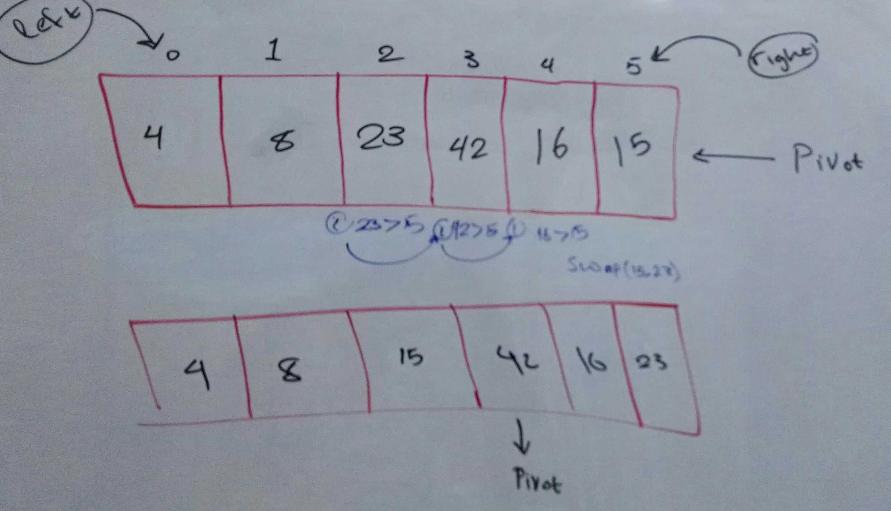
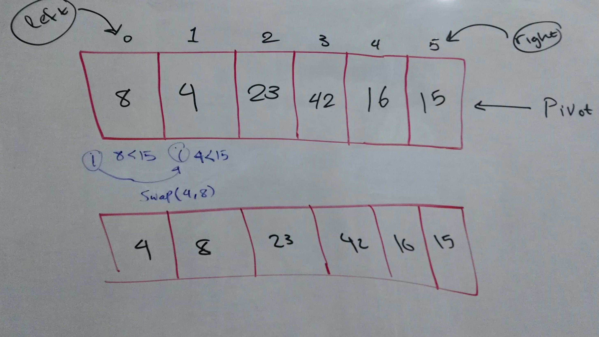
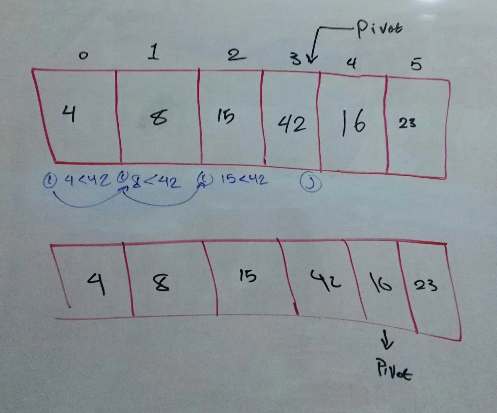
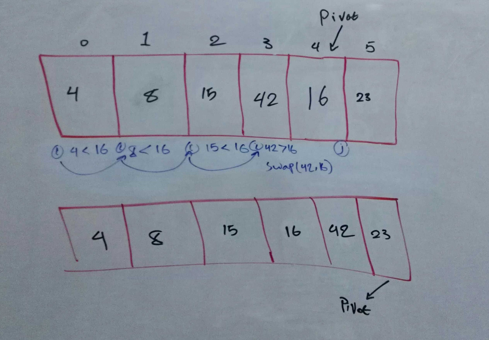
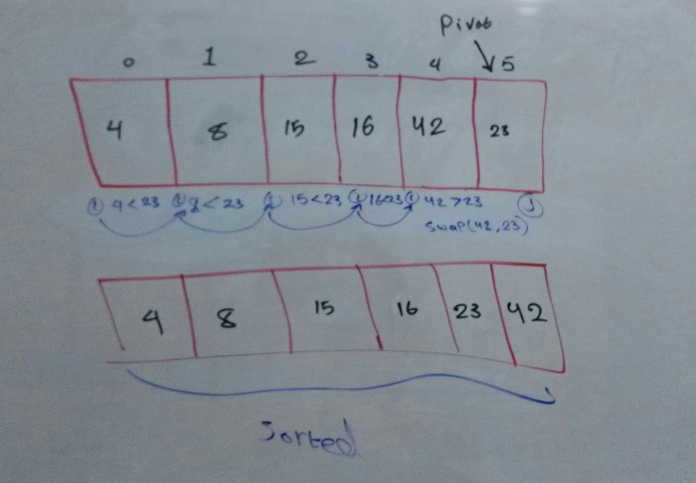

# Quick Sort
## Mohammad Samara

### Intro:

Quick Sort is a Divide and Conquer algorithm that is based on partitioning of array of data into smaller arrays.  
The Quick Sort algorithm is one of the most efficient sorting algorithms.  

We'll be tracing the Insertion Sort algorithm using the following psuedocode:
```js
ALGORITHM quickSort(arr, left, right)
    if left < right
        // Partition the array by setting the position of the pivot value 
        DEFINE position <-- partition(arr, left, right)
        // Sort the left
        quickSort(arr, left, position - 1)
        // Sort the right
        quickSort(arr, position + 1, right)

ALGORITHM partition(arr, left, right)
    // set a pivot value as a point of reference
    DEFINE pivot <-- arr[right]
    // create a variable to track the largest index of numbers lower than the defined pivot
    DEFINE low <-- left - 1
    for i <- left to right do
        if arr[i] <= pivot
            low++
            swap(arr, i, low)

     // place the value of the pivot location in the middle.
     // all numbers smaller than the pivot are on the left, larger on the right. 
     swap(arr, right, low + 1)
    // return the pivot index point
     return low + 1

ALGORITHM swap(arr, i, low)
    DEFINE temp;
    temp <-- arr[i]
    arr[i] <-- arr[low]
    arr[low] <-- temp
```

and using this array as input:  
`[8,4,23,42,16,15]`

### Procedure:

- we'll keep track of changes in each iteration by following the psuedocode line by line, excuting and reflecting the changes on the array.
- we'll trace the values in tables.
- in each iteration, we compare an element with its previous.


####  1:


####  2:


####  3:


####  4:


####  5:


Efficiency
Time: O(n logn) because at it's worse, there will be a for loop and how many times its swapped.

Space: O(n) Because the memory allocated depends on how big the array itself is.